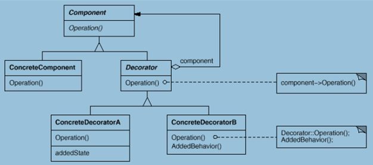

## Gof定义

动态地给一个对象增加一些额外的职责。就增加功能而言，Decorator模式比生成子类更为灵活。

首先来看一个小例子，假如我们需要给游戏开发一种坦克，除了各种不同型号的坦克外，还希望在不同的场合来给坦克增加以下的一种或多种功能：比如红外线夜视功能、水陆两栖功能、GPS定位功能等。通常做法如下：

```
/// <summary>
/// 抽象坦克
/// </summary>
public abstract class Tank
{
    public abstract void Shot();
    public abstract void Run();
}

//型号
public class T50 : Tank { }
public class T60 : Tank { }
public class T70 : Tank { }

//在不同场合下的各种功能都抽象为接口，
//如果某种型号的坦克需要某种功能就继承该功能接口
//下面的IA IB IC 为功能A B C的接口
/// <summary>
/// 有A功能的T50型号
/// </summary>
public class T50A : T50, IA { }
/// <summary>
/// 有A B两种功能的T60型号
/// </summary>
public class T60AB : T60, IA, IB { }
/// <summary>
/// 有A B C三种功能的T70型号
/// </summary>
public class T70ABC : T70, IA, IB, IC { }
```

## 动机

上面描述的问题的根源在于我们“过多地使用了继承来扩展对象的功能”，由于继承为赖幸引入了静态特质，使得这种扩展方式缺乏灵活性，并且随着子类的增多（扩展功能的增多)，各种子类的组合（扩展功能的组合）会导致更多子类的膨胀（多继承）。那么如何使“对象功能的扩展”能够根据需要来动态地实现，同时避免“扩展功能的增多”带来的子类膨胀问题，从而使得任何“功能的变化”所导致的影响减为最低呢？这就需要用到装饰模式（Decorator）。下面先来看下装饰模式的结构图：




Component：对应上面例子中的Tank。

ConcreteComponent：对应坦克的型号 T50 T60 T70等。

DeCorator ConcreteDecoratorA ConcreteDecoratorB 这三个类就是接下来要实现了。

```
public abstract class Decorator : Tank
{
    private Tank _tank;
    public Decorator(Tank tank)
    {
        _tank = tank;
    }
    public override void Shot()
    {
        _tank.Shot();
    }
    public override void Run()
    {
        _tank.Run();
    }
}

public class ConcreteDecoratorA : Decorator
{
    public ConcreteDecoratorA(Tank tank):base(tank){}
    public override void Shot()
    {
        //扩展红外功能
        base.Shot();
    }
    public override void Run()
    {
        base.Run();
    }
}

public class ConcreteDecoratorB : Decorator
{
    public ConcreteDecoratorB(Tank tank):base(tank){}
    public override void Shot()
    {
        //扩展两栖功能
        base.Shot();
    }
    public override void Run()
    {
        base.Run();
    }
}

public class ConcreteDecoratorC : Decorator
{
    public ConcreteDecoratorC(Tank tank) : base(tank) { }
    public override void Shot()
    {
        //扩展定位功能
        base.Shot();
    }
    public override void Run()
    {
        base.Run();
    }
}
```

客户端的调用

```
public class App
{
    static void Main()
    {
        Tank tank = new T50();
        //拥有红外一种功能
        ConcreteDecoratorA da = new ConcreteDecoratorA(tank);
        //拥有红外和两栖两种功能
        ConcreteDecoratorB db = new ConcreteDecoratorB(da);
        //拥有红外、两栖和定位三种功能
        ConcreteDecoratorC dc = new ConcreteDecoratorC(db);

        //需要什么功能可以在此随意组合，如果要扩展一种功能，只需要
        //添加一个具体的功能的类继承Decorator即可
    }
}
```

## Decorator模式的几个要点

* 通过采用组合、而非继承的手法， Decorator模式实现了在运行时动态地扩展对象功能的能力，而且可以根据需要扩展多个功能。避免了单独使用继承带来的“灵活性差”和“多子类衍生问题”。
* Component类在Decorator模式中充当抽象接口的角色，不应该去实现具体的行为。而且Decorator类对于Component类应该透明——换言之Component类无需知道Decorator类，Decorator类是从外部来扩 展Component类的功能。
* Decorator类在接口上表现为is-a Component的继承关系，即Decorator类继承了Component类所具有的接口。但在实现上又表现为has-a Component的组合关系，即Decorator类又使用了另外一个Component类。我们可以使用一个或者多个Decorator对象来“装饰”一个Component对象，且装饰后的对象仍然是一个Component对象。
* Decorator模式并非解决“多子类衍生的多继承”问题，Decorator模式应用的要点在于解决“主体类在多个方向上的扩展功能”——是为“装饰”的含义。

[返回开篇（索引）](http://blog.fwhyy.com/2009/11/design-patterns-notes-1-index/)


