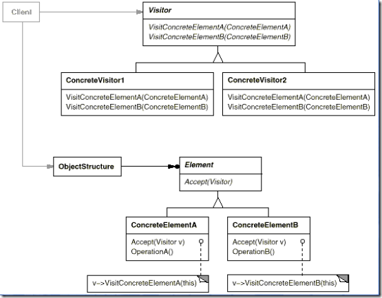

## Gof定义
表示一个作用于某对象结构中的各元素的操作。它可以在不改变各元素的类的前提下定义作用于这些元素的新的操作。

## 动机
在软件构建过程中，由于需求的改变，某些类层次结构中常常需要增加新的行为（方法），如果直接在基类中做这样的更改，将会给子类带来很繁重的变更负担，甚至破坏原有设计。如何在不更改类层次结构的前提下，在运行时根据需要透明地为类层次结构上的各个类动态添加新的操作，从而避免上述问题？请看下面访问者模式结构图和代码。

访问者模式结构图：




基本代码如下：

```
/// <summary>
/// 声明了一个或多个需要添加的操作
/// </summary>
public abstract class Visitor
{
    public abstract void VisitorConcreteElementA(ConcreteElementA concreteElementA);
    public abstract void VisitorConcreteElementB(ConcreteElementB concreteElementB);
}
/// <summary>
/// 操作的具体类1
/// </summary>
public class ConcreteVisitor1:Visitor
{
    public override void VisitorConcreteElementA(ConcreteElementA concreteElementA)
    {
        Console.WriteLine("{0}访问{1}", this.GetType().Name, concreteElementA.GetType().Name);
    }
    public override void VisitorConcreteElementB(ConcreteElementB concreteElementB)
    {
        Console.WriteLine("{0}访问{1}", this.GetType().Name, concreteElementB.GetType().Name);
    }
}
/// <summary>
/// 操作的具体类2
/// </summary>
public class ConcreteVisitor2 : Visitor
{
    public override void VisitorConcreteElementA(ConcreteElementA concreteElementA)
    {
        Console.WriteLine("{0}访问{1}", this.GetType().Name, concreteElementA.GetType().Name);
    }
    public override void VisitorConcreteElementB(ConcreteElementB concreteElementB)
    {
        Console.WriteLine("{0}访问{1}", this.GetType().Name, concreteElementB.GetType().Name);
    }
}
/// <summary>
/// 接受Visitor并使用其操作的抽象类
/// </summary>
public abstract class Element
{
    public abstract void Accept(Visitor visitor);
}
/// <summary>
/// 接受Visitor并使用其操作的具体类
/// </summary>
public class ConcreteElementA : Element
{
    public override void Accept(Visitor visitor)
    {
        visitor.VisitorConcreteElementA(this);
    }
    public void OperationA() { }
}
/// <summary>
/// 接受Visitor并使用其操作的具体类
/// </summary>
public class ConcreteElementB : Element
{
    public override void Accept(Visitor visitor)
    {
        visitor.VisitorConcreteElementB(this);
    }
    public void OperationB() { }
}
public class ObjectStructure
{
    private List<Element> list = new List<Element>();
    public void Add(Element element)
    {
        list.Add(element);
    }
    public void Del(Element element)
    {
        if(list.Contains(element))
            list.Remove(element);
    }
    public void Accept(Visitor visitor)
    {
        foreach (Element e in list)
        {
            e.Accept(visitor);
        }
    }
}
/// <summary>
/// 客户端代码
/// </summary>
class Program
{
    static void Main(string[] args)
    {
        ObjectStructure os = new ObjectStructure();
        os.Add(new ConcreteElementA());
        os.Add(new ConcreteElementB());
        Visitor cv1 = new ConcreteVisitor1();
        Visitor cv2 = new ConcreteVisitor2();
        os.Accept(cv2);
        os.Accept(cv1);
    }
}
```

## Visitor模式的几个要点
* Visitor模式通过所谓双重分发（double dispatch）来实现在不更改Element类层次结构的前提下，在运行时透明地为类层次结构上的各个类动态添加新的操作。
* Visitor模式通过所谓双重分发（double dispatch）来实现在不更改Element类层次结构的前提下，在运行时透明地为类层次结构上的各个类动态添加新的操作。
* Visitor模式的最大缺点在于扩展类层次结构（增添新的Element子类），会导致Visitor类的改变。因此Vistor模式适用于“Element类层次结构稳定，而其中的操作却经常面临频繁改动”。
 
[返回开篇（索引）](http://blog.fwhyy.com/2009/11/design-patterns-notes-1-index/)


