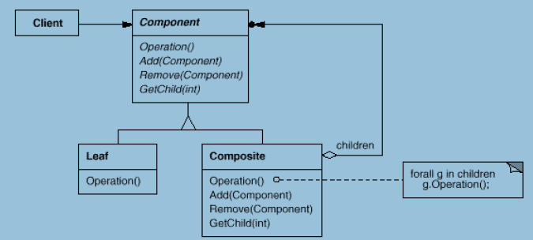
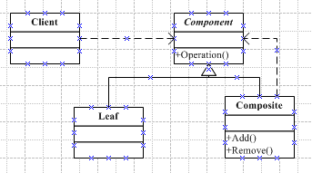

## Gof定义

将对象组合成树形结构以表示“部分–整体”的层次结构。Composite使得用户对单个对象和组合对象使用具有一致性。

在面向对象系统中，我们经常会遇到一类具有”容器“特征的对象—即他们在充当对象的同时，又是其他对象的容器。比如在一些管理系统中就会出现总公司下面有很多的分公司，分公司下面有很多的部门，每个部门下又有很多的员工，像分公司和部门就是既充当了“对象”的角色也充当了“容器”的角色；还有我们可能玩过的“俄罗斯套娃”也是这种结构，一个大娃娃里面装个小娃娃，小的里面又有个小的直到最小的一个，中间的娃娃就是既充当了“对象”也充当了“容器”。先看下面这个例子:

```
interface IBox
{
    void Process();
}
/// <summary>
/// 相当于树的叶子节点，没有子对象了
/// </summary>
public class SingleBox : IBox
{
    public void Process()
    { 

    }
}
/// <summary>
/// 容器
/// </summary>
public class ContainerBox : IBox
{
    List<IBox> list = new List<IBox>();
    public void Process() { }
    public List<IBox> GetBoxes()
    {
        return list;
    }
}
/// <summary>
/// 客户代码
/// </summary>
public class App
{
    static void Mina()
    {
        ///此处从工厂方法中得到盒子的对象，但我们不知道是SingleBox还是ContainerBox
        ///所以要做判断
        IBox box = Factory.Create();
        if (box is ContainerBox)
        {
            box.Process();
            List<IBox> list = ((ContainerBox)box).GetBoxes();
        }
        else if(box is SingleBox)
        {
            box.Process();
        }
    }
}
```

## 动机

上面代码的问题的根据在于：客户代码过多地依赖对象容器复杂的内部实现结构，对象容器内部实现结构（而非抽象接口）的变化将引起客户代码的频繁变化，带来了代码的维护性、扩展性等弊端。

如何将“客户代码与复杂的对象容器结构”解耦？让对象容器自己来实现自身的复杂结构，从而使得客户代码就像处理简单对象一样来处理复杂的对象容器？

这就要使用Composite模式了，先看下Composite模式的结构图：



* Component：定义了Leaf和Composite的一些共有特性。
* Composite：有容器特征的类型。
* Leaf：叶节点，即一个单独的个体，下面没有子节点。

依据上面的结构图完成代码实现：

```
public abstract class Component
{
    protected string _name;
    public Component(string name)
    {
        _name = name;
    }
    public abstract void Operation();
    public abstract void Add(Component component);
    public abstract void Remove(Component component);
}

public class Leaf : Component
{
    public Leaf(string name) : base(name) { }
    public override void Add(Component component)
    {
        throw new NotSupportedException();
    }
    public override void Remove(Component component)
    {
        throw new NotSupportedException();
    }

    public override void Operation()
    {
        //...do something
    }
}

public class Composite : Component
{
    public Composite(string name):base(name){}
    List<Component> list = new List<Component>();
    /// <summary>
    /// 添加
    /// </summary>
    /// <param name="conponent"></param>
    public override void Add(Component component)
    {
        if (list != null)
        {
            list = new List<Component>();
        }
        list.Add(component);
    }
    /// <summary>
    /// 删除
    /// </summary>
    /// <param name="component"></param>
    public override void Remove(Component component)
    {
        if (list == null)
        {
            throw new NullReferenceException();
        }
        list.Remove(component);
    }

    public override void Operation()
    {
        if (list != null)
        {
            foreach (Component c in list)
            {
                c.Operation();
            }
        }
    }
}
```

Leaf类为叶子节点类，它的实例是没有子节点的，但是在抽象类中的方法Add和Remove方法必须要实现，按理说这样的实现是没有意义的，所以在此处抛出了NotSupportedException 异常，在客户端调用捕获到再做相应的处理，这种模式称之为“透明足组合模式”，这样做的好处是叶子（Leaf）和容器（Composite）对于外界没有分别，它们具有一致的接口行为。还有一种情况叫“安全组合模式”，在抽象类（Component）中不定义Add Remove方法，而是在容器的实现类中去定义，这样就各司其职了，看下面结构图：




代码实现

```
public abstract class Component
{
    protected string _name;
    public Component(string name)
    {
        _name = name;
    }
    public abstract void Operation();
}

public class Leaf : Component
{
    public Leaf(string name) : base(name) { }

    public override void Operation()
    {
        //...do something
    }
}

public class Composite : Component
{
    public Composite(string name) : base(name) { }
    List<Component> list = new List<Component>();
    /// <summary>
    /// 添加
    /// </summary>
    /// <param name="conponent"></param>
    public void Add(Component component)
    {
        if (list != null)
        {
            list = new List<Component>();
        }
        list.Add(component);
    }
    /// <summary>
    /// 删除
    /// </summary>
    /// <param name="component"></param>
    public void Remove(Component component)
    {
        if (list == null)
        {
            throw new NullReferenceException();
        }
        list.Remove(component);
    }

    public override void Operation()
    {
        if (list != null)
        {
            foreach (Component c in list)
            {
                c.Operation();
            }
        }
    }
}
```

使用“安全组合模式”Leaf和Composite就不具有相同的接口，所以在客户端调用的时候还是要去判断是什么类型，比较麻烦。所以说选择哪种还要看具体的需求。

## Composite模式的几个要点

* Composite模式采用树形结构来实现普遍存在的对象容器，从而将“一对多”的关系转化为“一对一”的关系，使得客户代码可以一致地处理对象和对象容器，无需关心处理的是单个的对象还是组合的对象容器。
* 将“客户代码与复杂的对象容器结构”解耦是Composite模式的核心思>想，解耦之后，客户代码将与纯粹的抽象接口——而非对象容器的复内部实现结构——发生依赖关系，从而更能“应对变化”。
* Composite模式中，是将“Add和Remove等和对象容器相关的方法”定义在“表示抽象对象的Component类”中，还是将其定义在“表示对象容器的Composite类”中，是一个关乎“透明性”和“安全性”的两难问题，需要仔细权衡。这里有可能违背面向对象的“单一职责原则”，但是对于这种特殊结构，这又是必须付出的代价。ASP.NET控件的实现在这方面为我们提供了一个很好的示范。
* Composite模式在具体实现中，可以让父对象中的子对象反向追溯； 如果父对象有频繁的遍历需求，可使用缓存技巧来改善效率。

[返回开篇（索引）](http://blog.fwhyy.com/2009/11/design-patterns-notes-1-index/)


