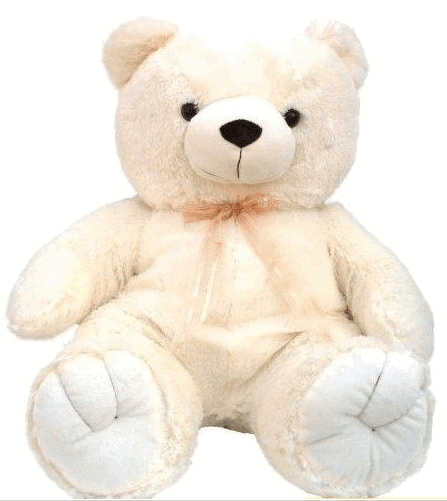

最近实在是太忙了，以至于这么重要的节日我都忘记了在博客中记下一笔。趁今天这个午休的时间来写下吧。

七夕是我和老婆在一起后的第一个比较重大的节日，我们是今年3月才开始在一起的，准确的说现在还是我的女朋友，不过在我心里她已经是我老婆了，所以称之为老婆。

七夕的前几天，我们在网上团购了好伦哥的自助餐，准备七夕晚上去吃，不巧的是老婆上火，口腔嘴唇都长了溃疡，喝凉水都疼，更别说是吃自助餐了。所以当时就决定等溃疡好了我们再去。

决定溃疡好了再去吃的那天是2010-08-13，星期五。当时想不能去吃自助了，那我得买件礼物送她，对于我们这样一个很土且不浪漫的人来说，选礼物比写程序要难。幸好我记得有两件东西她是超喜欢的，娃娃和冰激凌。于是马上就到网上去订购了一个大坐熊。

星期六的中午，老婆在做饭，快递人员电话说东西到了，让我下楼去取,东西拿到屋子后，老婆问我是什么，我很平静地说：“我在网上买了个熊”。老婆开始还不相信，后来进到房间才发现是真的，不过也表现地很平静，不过从眼神我能看出她是很喜欢的。

从买熊到现在老婆的一些表现可以看出，当时她看到熊的那一刻的平静时装出来的，我发现她很喜欢那个熊，以至于睡觉都抱着熊不抱我了毛毛仔大坐熊

在北京漂着的日子很不容易，每天要挤拥挤的地铁，要面对工作中的种种压力，老婆更不容易，下班回家还要做饭，老婆你辛苦了，希望我们能永远都这么开心，这里也会记录我们的开心的点点滴滴。

