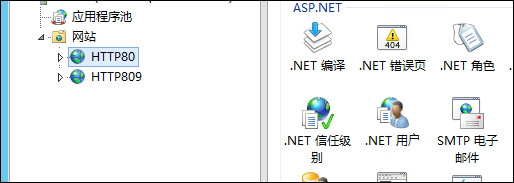
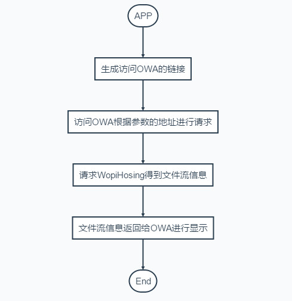

Office Web App是用来做Office文档预览的一个很好的工具，网上的很多资料大都是跟SharePoint集成、Lync集成等，并且基本都是在内网部署。本文主要介绍下怎样在外网部署实现预览功能。

## 安装

OWA的安装可以参考下面链接：

[https://technet.microsoft.com/zh-cn/library/jj219455.aspx](https://technet.microsoft.com/zh-cn/library/jj219455.aspx)

有关安装OWA的PowerShell命令可以参考下面链接：

[http://technet.microsoft.com/zh-cn/library/ee890080.aspx](http://technet.microsoft.com/zh-cn/library/ee890080.aspx)

## 准备工作

OWA不能安装在域控上，所以必须准备两台服务器，如下：

* 域控服务器
	* 服务器版本：Windows Server2012R2
	* 域名：fwhyy.com
	* 内网IP：10.15.3.160
	* 外网IP：100.180.100.180
* OWA服务器
	* 服务器版本：Windows Server2012R2
	* 完整机器名：owa.fwhyy.com
	* 内网IP：10.15.3.180
	* 外网IP：100.180.100.181
* 申请外网域名：owa.fwhyy.com，绑定到OWA服务器的外网IP：100.180.100.181

## 部署

1.在OWA服务器上执行下面PowerShell命令：

```
New-OfficeWebAppsFarm -InternalUrl "http://10.15.3.180" -AllowHttp -EditingEnabled -OpenFromUrlEnabled
```

注意InternalUrl 需要配置内网IP

2.命令成功执行后，会在IIS中创建两个站点，如下图：




3.在浏览器中输入：[http://owa.fwhyy.com/hosting/discovery](http://owa.fwhyy.com/hosting/discovery)会得到一个放回xml结果的页面，**该xml文件中显示的地址为内网IP，需要将内网IP换成域名：owa.fwhyy.com**。保存该页面为discovery.xml文件留作备用。不同类型的文档会指向不同的页面来做预览，生成预览链接时会用到discovery.xml文件。

4.如果要将OWA的预览功能和自己的应用程序进行整合，还需要有一个Web API程序进行辅助，有关这部分内容可以参考下面链接：

[http://www.cnblogs.com/poissonnotes/p/3267190.html](http://www.cnblogs.com/poissonnotes/p/3267190.html)

[http://www.cnblogs.com/poissonnotes/p/3277280.html](http://www.cnblogs.com/poissonnotes/p/3277280.html)

具体请求流程参见下图：




5.除了discovery.xml中的地址需要修改为域名，其他所有涉及到有请求的地方全部使用内网IP。

## 总结

外网访问其实关键的是需要注意三点：

* 使用PowerShell命令创建站点时使用内网IP；
* 需要用域名进行访问，并且申请的域名必须和OWA服务器的完整机器名一致；
* 只有discovery.xml中的地址需要为域名，其他所有都是用内网IP。

后面会单独开篇来写一个简单的示例，包含改造后的WopiHosting部分。


