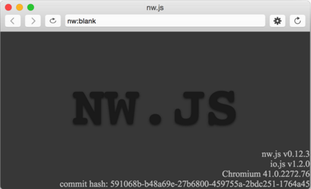
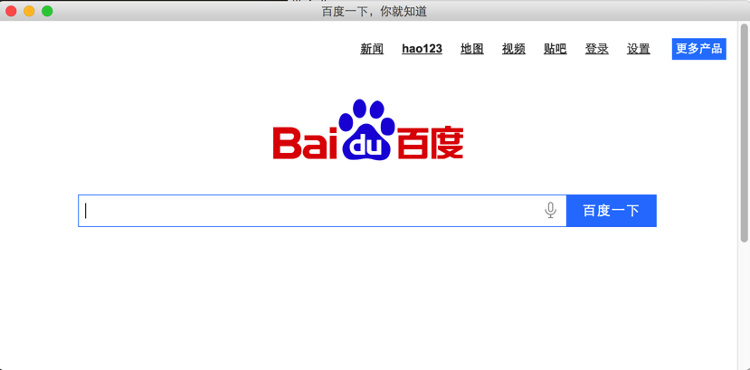

本文主要介绍在windows和mac下如果使用nw.js来制作桌面应用程序，以及如何制作成安装包，本文不涉及nw.js的开发，只是用nw.js做壳包一个web应用而已。

## 一些参考链接

* [http://nwjs.io/](http://nwjs.io/)
* [https://github.com/nwjs/nw.js](https://github.com/nwjs/nw.js)
* [https://github.com/nwjs/nw.js/wiki](https://github.com/nwjs/nw.js/wiki)
* [http://www.cnblogs.com/xuanhun/tag/node.js/](http://www.cnblogs.com/xuanhun/tag/node.js/)
* [http://blog.yorkgu.me/2015/05/12/how-to-make-dmg-files-in-mac-osx/](http://blog.yorkgu.me/2015/05/12/how-to-make-dmg-files-in-mac-osx/)
* [https://github.com/nwjs/nw.js/wiki/manifest-format](https://github.com/nwjs/nw.js/wiki/manifest-format)
* [https://github.com/nwjs/nw.js/wiki/Icons](https://github.com/nwjs/nw.js/wiki/Icons)
* [http://www.angusj.com/resourcehacker/](http://www.angusj.com/resourcehacker/)

## Windows版本

首先在[http://nwjs.io/](http://nwjs.io/) 上下载相应的Windows版本，解压到C盘根目录中，在该目录中添加Test目录，如下图：


在Test目录中添加如下文件：


* link.png：程序到图标文件
* package.json：配置文件

package.json的代码如下，详细配置信息参考[配置](https://github.com/nwjs/nw.js/wiki/manifest-format)：

```
{
  "main": "http://www.baidu.com",
  "name": "nwjs测试",
  "description": "nwjs测试",
  "version": "0.1.0",
  "keywords": [ "nwjs测试" ],
  "window": {
    "title": "nwjs测试",
    "icon": "link.png",
    "toolbar": false,
    "frame": true,
    "width": 1000,
    "height": 680,
    "position": "center",
    "min_width": 1000,
    "min_height": 680,
    "max_width": 0,
    "max_height": 0,
    "show_in_taskbar":true
  },

  "webkit": {
    "plugin": true
  }
}
```

现在拖动Test目录到nw.exe文件上，程序就可以运行起来了：


效果如下：


接下来就要将程序打包成一个可以执行到exe文件了，进入到Test目录中，将目录中的所有文件压缩成Test.zip，将Test.zip移动到nw.exe的同级目录，打开命令行进入到该目录中，执行下面命令：

```
copy /b nw.exe+Test.zip Test.exe
```

命令执行成功后会在该目录中生成Test.exe文件，双击该文件便可打开程序，但如果将Test.exe复制到别的目录中，会发现不能正常运行了，因为Test.exe还依赖他同级目录中的一些dll文件，两种方式来处理这个问题：

1. 将依赖的dll文件和Test.exe打包成一个文件

制作单一可执行程序可以使用Enigma Virtual Box，具体使用方法网上有很多教程，例如：

[http://sphrbeu2012.blog.163.com/blog/static/2092280742012518111358468/](http://sphrbeu2012.blog.163.com/blog/static/2092280742012518111358468/)

2. 制作一个安装程序

制作安装程序可以使用inno，例如：

[http://www.cnblogs.com/way_testlife/archive/2011/04/08/2009528.html](http://www.cnblogs.com/way_testlife/archive/2011/04/08/2009528.html)

注意：

通过上面的命令生成的Test.exe文件的图标是nwjs的默认图标，可以通过[resourcehacker](http://www.angusj.com/resourcehacker/)来进行图标的修改。

## Mac版本

在http://nwjs.io/上下载合适的Mac版本，解压后放到根目录下，修改目录名称为nwjs-osx-32，如下图：


在终端中执行下面命令：

```
cd ~
cd ls -a 
```


如果发现有.bash_profile文件，输入vim .bash_profile命令对该文件进行编辑，添加如下代码后保存退出，关于vim命令的使用本文就不介绍了：

```
alias nw="~/nwjs-osx-32/nwjs.app/Contents/MacOS/nwjs"
```


修改完.bash_profile文件后，执行下面命令使修改能即时生效：

```
source ~/.bash_profile 
```

现在在终端中输入nw，如果出现下图界面说明配置成功：




利用下面的命令在根目录中创建Test目录，并在Test目录中创建package.json文件：

```
cd ~
mkdir Test
cd Test
touch package.json
```

package.json文件的内容如下：

```
{
  "main": "http://www.baidu.com",
  "name": "nwjs test",
  "description": "nwjs test",
  "version": "0.1.0",
  "keywords": [ "nwjs test" ],
  "window": {
    "title": "nwjs test",
    "icon": "link.png",
    "toolbar": false,
    "frame": true,
    "width": 1000,
    "height": 680,
    "position": "center",
    "min_width": 1000,
    "min_height": 680,
    "max_width": 1000,
    "max_height": 680,
    "show_in_taskbar":true
  },

  "webkit": {
    "plugin": true
  }
}
```

在根目录中输入命令nw Test ，如果出现下面截图说明运行成功：




程序运行没有问题，接下来就要开始打包了，将~/nwjs-osx-32/nwjs.app 目录拷贝到根目录，并修改名字为test.app，可以在根目录下输入下面命令：

```
cp -R ~/nwjs-osx-32/nwjs.app ~/
mv nwjs.app test.app
```

打包项目文件Test到test.app/Contents/Resources/目录中，在Test目录中执行下面命令：

```
zip -r ../test.app/Contents/Resources/app.nw *
```

现在在根目录下输入下面命令，应该可以看到和上面执行相同的效果：

```
open test.app
```

到此，Mac下的可执行文件已制作完成，如果想将test.app制作成可以安装的dmg文件，可以使用系统自带的磁盘工具，具体参考：

[http://blog.yorkgu.me/2015/05/12/how-to-make-dmg-files-in-mac-osx/](http://blog.yorkgu.me/2015/05/12/how-to-make-dmg-files-in-mac-osx/)

