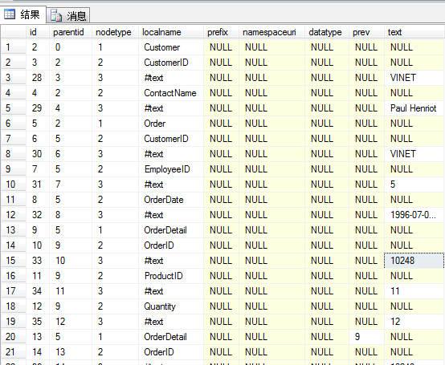

有时会在存储过程中处理一些XML格式的数据，所以会用到sp_xml_preparedocument，他可以将XML数据进行读取，然后使用 MSXML 分析器 (Msxmlsql.dll) 对其进行分析。我们就可以很容易的在存储过程中得到XML中我们想要的数据。下面的代码就是使用sp_xml_preparedocument读取XML：

```
DECLARE @hdoc int
DECLARE @doc varchar(1000)
SET @doc ='
<ROOT>
<Customer CustomerID="VINET" ContactName="Paul Henriot">
   <Order CustomerID="VINET" EmployeeID="5" OrderDate="1996-07-04T00:00:00">
      <OrderDetail OrderID="10248" ProductID="11" Quantity="12"/>
      <OrderDetail OrderID="10248" ProductID="42" Quantity="10"/>
   </Order>
</Customer>
<Customer CustomerID="LILAS" ContactName="Carlos Gonzlez">
   <Order CustomerID="LILAS" EmployeeID="3" OrderDate="1996-08-16T00:00:00">
      <OrderDetail OrderID="10283" ProductID="72" Quantity="3"/>
   </Order>
</Customer>
</ROOT>'
```

EXEC sp_xml_preparedocument @hdoc OUTPUT, @doc
上面只是读取了XML，要想获取XML数据还需要使用OPENXML，代码如下：

```
SELECT *
FROM openxml(@hdoc,'/ROOT/Customer',1)
WITH (CustomerID VARCHAR(40),ContactName VARCHAR(40)) 
```

OPENXML有三个参数：

* 第一个是sp_xml_preparedocument读取是的OUTPUT参数，在本示例中就是@hdoc；
* 第二个是一个XPath表达式，用来获取指定位置的数据；
* 第三个是一个可选项，用来表示获取的方式，有0,1,2,8四种取值，详细解释[请看](http://msdn.microsoft.com/zh-cn/library/ms186918.aspx)

FROM后面的WITH也是可选的，用来指定获取哪些数据字段，上面代码中只取了CustomerID和ContactName。上面的查询结果如下：

| CustomerID | ContactName |
| --- | --- |
| LILAS | Carlos Gonzlez |

如果不指定WITH子句，查询出来的是一个默认的表结构，如下：



表格列的解释说明：


在WITH子句中,我们还可以通过设置来获取父级元素的属性值:

```
DECLARE @hdoc int
DECLARE @doc varchar(1000)
SET @doc ='
<ROOT>
<Customer CustomerID="VINET" ContactName="Paul Henriot">
   <Order OrderID="10248" CustomerID="VINET" EmployeeID="5"
           OrderDate="1996-07-04T00:00:00">
      <OrderDetail ProductID="11" Quantity="12"/>
      <OrderDetail ProductID="42" Quantity="10"/>
   </Order>
</Customer>
<Customer CustomerID="LILAS" ContactName="Carlos Gonzlez">
   <Order OrderID="10283" CustomerID="LILAS" EmployeeID="3"
           OrderDate="1996-08-16T00:00:00">
      <OrderDetail ProductID="72" Quantity="3"/>
   </Order>
</Customer>
</ROOT>'

EXEC sp_xml_preparedocument @hdoc OUTPUT, @doc
SELECT *
FROM   OPENXML (@hdoc, '/ROOT/Customer/Order/OrderDetail',2)
         WITH (OrderID       int         '../@OrderID',
               CustomerID  varchar(10) '../@CustomerID',
               OrderDate   datetime    '../@OrderDate',
               ProdID      int         '@ProductID',
               Qty         int         '@Quantity')
```

查询的结果为:

OrderID     CustomerID OrderDate               ProdID      Qty
———– ———- ———————– ———– ———–
10248       VINET      1996-07-04 00:00:00.000 11          12
10248       VINET      1996-07-04 00:00:00.000 42          10
10283       LILAS      1996-08-16 00:00:00.000 72          3

有时候XML中的数据并不是以属性的方式存在,而是直接放在节点中,如下:

```
DECLARE @doc varchar(1000)
SET @doc ='
<ROOT>
<Customer CustomerID="VINET" ContactName="Paul Henriot">
   <Order>
     <OrderID>10248</OrderID>
     <CustomerID>VINET</CustomerID>
     <EmployeeID>5</EmployeeID>
     <OrderDate>1996-07-04T00:00:00</OrderDate>
   </Order>
</Customer>
</ROOT>'
```

此时要获Order节点下的各项的值,可以用下面方法:

```
DECLARE @hdoc int
DECLARE @doc varchar(1000)
SET @doc ='
<ROOT>
<Customer CustomerID="VINET" ContactName="Paul Henriot">
   <Order>
     <OrderID>10248</OrderID>
     <CustomerID>VINET</CustomerID>
     <EmployeeID>5</EmployeeID>
     <OrderDate>1996-07-04T00:00:00</OrderDate>
   </Order>
</Customer>
</ROOT>'

EXEC sp_xml_preparedocument @hdoc OUTPUT, @doc
SELECT *
FROM   OPENXML (@hdoc, '/ROOT/Customer/Order',1)
WITH (OrderID       int         'OrderID',
   CustomerID  varchar(10) 'CustomerID',
   EmployeeID   int    'EmployeeID',
   OrderDate      datetime         'OrderDate')
```

查询结果如下:

OrderID     CustomerID EmployeeID  OrderDate
———– ———- ———– ———————–
10248       VINET      5           1996-07-04 00:00:00.000

可以看出是取属性值还是取节点的文本的值区别在于WITH子句的第三个参数是否有@符号


