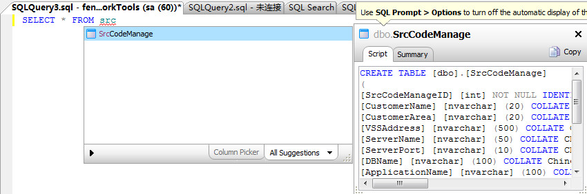
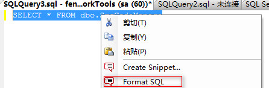
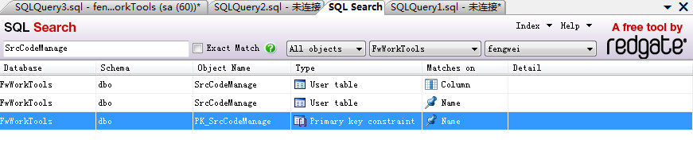

## 智能提示

SQL Prompt5的智能提示比SqlServer自带的要好很多，而且可以设置让关键字自动大写，对于数据库中的对象可以很方便的看到对象的创建脚本，如下图：




## 格式化代码

有时候我们把从程序中跟踪到的代码或是从SQL跟踪器中跟踪到的代码贴到SqlServer中时是没有格式的，有时甚至是在一行显示，非常不方便阅读，有了SQL Prompt5，就可以选择代码点击右键，点击Format SQL，如下图：




## SQL Search

SQL Search是SQL Prompt5中才提供的一个辅助功能，能可以很方便的查询数据库中的对象在数据库中的引用情况，比如查询一个表，使用过该表的函数、视图和存储过程都展示出来，如下图：




## 代码片段

安装了SQL Prompt5后，会在SqlServer中添加名为SQL Prompt5的菜单，该菜单中的Snippet Manager可以对代码片段进行管理，比如在表中添加一个字段时先判断是否存在该字段，如存在先删除，然后再添加，代码如下：

```
IF EXISTS ( SELECT 1
            FROM dbo.syscolumns WHERE [name] = 'columnName' AND id = OBJECT_ID('tableName') ) BEGIN ALTER TABLE tableName DROP COLUMN columnName END GO ALTER TABLE tableName ADD columnName VARCHAR(50)
```

上面的代码可以用代码片段管理起来，可以设置一个简单快捷名称，如addcol，设置好后，在SqlServer中输入addcol然后点击tab键，就可以快速输入上面的代码。


